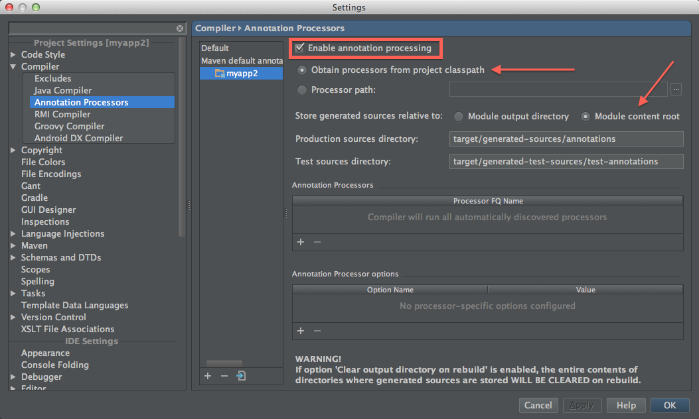

# Koloboke Compile Tutorial

## Table of Contents
 - [Introduction](#introduction)
 - [Why I may want to use Koloboke Compile?](#why-i-may-want-to-use-koloboke-compile)
 - [Supported Java versions](#supported-java-versions)
 - [Build configuration](#build-configuration)
 - [Basic usage](#basic-usage)
   - [Map-like generic class](#map-like-generic-class)
   - [Set-like class](#set-like-class)
   - [Interface](#interface)
   - [Specialized class](#specialized-class)
   - [More reasonable static factory methods](#more-reasonable-static-factory-methods)
   - [Reduce API](#reduce-api)
   - [Extend API](#extend-api)
   - [Primitive specializations](#primitive-specializations)
   - [Reference keys, primitive values](#reference-keys-primitive-values)
 - [Implementation customizations](#implementation-customizations)
   - [Reduce mutability](#reduce-mutability)
   - [Allow the `null` key](#allow-the-null-key)
   - [Hash table configuration](#hash-table-configuration)
 - [Javadocs](#javadocs)
 - [Advanced usage](#advanced-usage)
   - [Custom key equivalence](#custom-key-equivalence)
     - [`IdentityHashMap`-like Koloboke map with primitive
     values](#identityhashmap-like-koloboke-map-with-primitive-values)
   - [Underriding methods](#underriding-methods)
   - [Constructor parameters and fields](#constructor-parameters-and-fields)
   - [Model method renaming](#model-method-renaming)
     - [Lighter-weight alternative to
     `Collections.synchronizedMap()`](#lighter-weight-alternative-to-collectionssynchronizedmap)
   - [Default value in Maps with numeric primitive
   values](#default-value-in-maps-with-numeric-primitive-values)
 - [Best practices](#best-practices)
   - [Mark all concrete methods `final`](#mark-all-concrete-methods-final)
   - [Do reduce API](#do-reduce-api)
   - [Use `@Updatable` when applicable](#use-updatable-when-applicable)
   - [Prefer abstract classes to interfaces](#prefer-abstract-classes-to-interfaces)
   - [Maybe add an explicit, inaccessible
   constructor](#maybe-add-an-explicit-inaccessible-constructor)
 - [Achieving maximum performance](#achieving-maximum-performance)
   - [Follow best practices](#follow-best-practices)
   - [Use `justPut()` and `justRemove()` methods](#use-justput-and-justremove-methods)
   - [*Avoid* using `@NullKeyAllowed`](#avoid-using-nullkeyallowed)
   - [Disable concurrent modification checks](#disable-concurrent-modification-checks)
 - [Samples](#samples)
 - [IDE and tools configuration](#ide-and-tools-configuration)
   - [IntelliJ IDEA](#intellij-idea)
   - [Eclipse](#eclipse)
   - [Other IDE + build tool combinations](#other-ide--build-tool-combinations)
   - [FindBugs](#findbugs)
   - [Compiler warnings](#compiler-warnings)
 - [Known issues](#known-issues)
 - [Troubleshooting and asking questions](#troubleshooting-and-asking-questions)


## Introduction
Koloboke Compile is a Java source code generator. It generates implementations for your
collection-like abstract classes or interfaces (currently only `Map`-like and `Set`-like).

Koloboke Compile runs inside `javac` as a standard annotation processor. It reads your abstract
class or interface and infers what the implementation class should look like. It generates source
code, in your package, of a concrete implementation class which extends your class or implements
your interface.

Koloboke Compile is inspired by the [Immutables](http://immutables.github.io/), [Google Auto](
https://github.com/google/auto) and [Dagger](http://google.github.io/dagger/) projects.
If you are familiar with the Google Auto project, the phrase "Koloboke Compile is Auto for
collections" will give you an immediate understanding of what Koloboke Compile is. You could read
the excellent [Immutables](http://immutables.github.io/getstarted.html) or [Auto Value](
https://github.com/google/auto/blob/master/value/userguide/index.md) user guides to understand the
concepts of compile-time source code generation libraries better, also maybe to start using these
great projects.

## [Why I may want to use Koloboke Compile?](https://koloboke.com/compile)

## Supported Java versions
You can use Koloboke Compile with java compiler from Java 7 platform or newer, however Koloboke
Compile generates sources that are compatible with with Java 6, so `-source` and `-target` versions
could be **1.6 or higher**.

`javac` and Eclipse Compiler for Java (ECJ) are supported.

## Build configuration
To start using Koloboke Compile, you should just add the following dependencies in your Maven
`pom.xml`:
```xml
  <dependency>
    <groupId>com.koloboke</groupId>
    <artifactId>koloboke-compile</artifactId>
    <version>0.5.1</version>
    <scope>provided</scope>
  </dependency>
  <dependency>
    <groupId>com.koloboke</groupId>
    <!-- `jdk6-7` instead of `jdk8` if you use Java 6 or 7 -->
    <artifactId>koloboke-impl-common-jdk8</artifactId>
    <version>1.0.0</version>
  </dependency>
```

Or in your Gradle build script, you should first apply the [`propdeps` Gradle plugin](
https://github.com/spring-projects/gradle-plugins/tree/master/propdeps-plugin#overview) to enable
`provided` dependencies, and then configure the `dependencies` block:
```groovy
dependencies {
    provided 'com.koloboke:koloboke-compile:0.5.1'
    // `jdk6-7` instead of `jdk8` if you use Java 6 or 7
    compile 'com.koloboke:koloboke-impl-common-jdk8:1.0.0'
}
```

The table of compatible versions:
<table>
 <tr><th></th><th><code>koloboke-compile</code></th><th><code>koloboke-impl-common-jdk*</code></th>
 </tr>
 <tr><td></td><td>0.5-0.5.1</td><td>1.0.0</td></tr>
 <tr><td>Latest versions</td>
 <td>
 <a href="https://maven-badges.herokuapp.com/maven-central/com.koloboke/koloboke-compile">
 
 </a>
 </td>
 <td>
 <a href="https://maven-badges.herokuapp.com/maven-central/com.koloboke/koloboke-impl-common-jdk8">
 
 </a>
 </td>
 </tr>
</table>

## Basic usage
### Map-like generic class
Class definition:
```java
import com.koloboke.compile.KolobokeMap;
import java.util.Map;

@KolobokeMap
abstract class MyMap<K, V> implements Map<K, V> {
    static <K, V> Map<K, V> withExpectedSize(int expectedSize) {
        return new KolobokeMyMap<K, V>(expectedSize);
    }
}
```

 1. Annotate a Map-like class with `@KolobokeMap`
 2. Provide a static factory method, that instantiates a class called as your class with `Koloboke`
 prefix. A constructor of this class accepts an `int` parameter, that means the *expected size* of
 the map or set to construct.
 3. Use it:

      ```java
      Map<String, String> tickers = MyMap.withExpectedSize(10);
      tickers.put("AAPL", "Apple, Inc.");
      ```

You can also construct `KolobokeMyMap` directly from anywhere within the package of `MyMap`, but it
is recommended to reference the generated class only from static factory methods, defined in the
implemented class itself. Note that static factories are recommended in *Effective Java*, Item 1.

The `KolobokeMyMap` identifier is non-existent yet, and will be highlighted with red in your IDE,
but it won't be a project or an IDE build error! Koloboke Compile generates this class during
compilation. See also the [IDE configuration](#ide-and-tools-configuration) section.

**Implementation classes, generated by Koloboke Compile, are based on hash tables, not synchronized,
and don't keep the insertion order.** Currently there are no other options, but in future Koloboke
Compile may learn how to generate tree-based, concurrent, ordered implementations, and any
combinations of these.

### Set-like class
Use Koloboke Compile for Set-like classes the same way as for Map-like classes:
```java
import com.koloboke.compile.KolobokeSet;
import java.util.Set;

@KolobokeSet
abstract class MySet<E> implements Set<E> {
    static <E> Set<E> withExpectedSize(int expectedSize) {
        return new KolobokeMySet<E>(expectedSize);
    }
}
```

### Interface
The type to be implemented could also be an interface:
```java
@KolobokeMap
interface MyMap<K, V> extends Map<K, V> { /*...*/ }
```
But this might be less convenient pre-Java 8, because static methods are not allowed in interfaces
prior to Java 8, hence you cannot place static factory methods directly in the implemented
interface.

### Specialized class
Your class shouldn't be a generic class, like `java.util.Map`. It could be specialized for your use
case:

```java
@KolobokeMap
abstract class Tickers implements Map<String, String> {
    static Tickers withExpectedSize(int expectedSize) {
        return new KolobokeTickers(expectedSize);
    }
}
```

Usage:
```java
Tickers tickers = Tickers.withExpectedSize(10);
tickers.put("AAPL", "Apple, Inc.");
```

### More reasonable static factory methods
More examples of useful static factory methods, that you could write for your class:
```java
@KolobokeMap
abstract class Tickers implements Map<String, String> {
    static Tickers withExpectedSize(int expectedSize) {
        return new KolobokeTickers(expectedSize);
    }

    static Tickers of() {
        return withExpectedSize(10);
    }

    static Tickers fromMap(Map<String, String> m) {
        Tickers tickers = withExpectedSize(m.size());
        tickers.putAll(m);
        return tickers;
    }
}
```

### Reduce API
Your class shouldn't extend `java.util.Map`. You could declare just a few abstract methods
"from Map interface" that you need directly in your class, and Koloboke Compile will generate a
smaller class, that implements only those methods:
```java
@KolobokeMap
abstract class Cache<K, V> {
    static <K, V> Cache<K, V> withExpectedSize(int expectedSize) {
        return new KolobokeCache<K, V>(expectedSize);
    }

    abstract V put(K key, V value);

    abstract V get(K key);

    abstract void clear();

    abstract int size();
}
```

In fact Koloboke Compile doesn't care about superclasses or superinterfaces of the `@KolobokeMap`-
or `@KolobokeSet`-annotated class. It just looks at abstract methods in this class, and overrides
them in the generated implementation.

This is a recommended practice to declare just a few methods which you need instead of simply
extending/implementing the `Map` or `Set` interface.

<a name="raw-methods"></a>
Note that the `get()` method in the `Cache` class is defined with a generic `K` parameter, while
the `get()` method in the `Map` interface has an `Object` parameter. Koloboke Compile recognizes
"generified" `get()`, `remove()`, `contains()` (in Set-like classes), `containsKey()`, etc. methods,
all of which have `Object` parameters in the Java Collections Framework. Koloboke Compile allows
both versions ("raw" and "generified") of `get()`, `remove()` etc. methods, but if you declare these
methods on your own, it is recommended to stick to "generified" versions, because it improves type
safety of usage of your class.

### Extend API
Koloboke Compile supports not just `java.util.Map` and `java.util.Set` interfaces, but their
extended versions from the Koloboke Collections API, i. e. [`HashObjObjMap`](
http://leventov.github.io/Koloboke/api/1.0/java8/com/koloboke/collect/map/hash/HashObjObjMap.html)
and [`HashObjSet`](
http://leventov.github.io/Koloboke/api/1.0/java8/com/koloboke/collect/set/hash/HashObjSet.html).
They provide [many useful API additions](
http://leventov.github.io/Koloboke/api/1.0/java8/overview-summary.html#api-additions) beyond the
standard interfaces from the Java Collections Framework:
```java
@KolobokeMap
abstract class ExtendedMap<V> implements HashObjObjMap<String, V> {
    static <V> ExtendedMap<V> withExpectedSize(int expectedSize) {
        return new KolobokeExtendedMap<V>(expectedSize);
    }
}
```

Usage:
```java
ExtendedMap<String> map = ExtendedMap.withExpectedSize(10);
assertTrue(map.ensureCapacity(1000));
assertTrue(map.shrink());
```

To make Koloboke Compile to generate useful methods from the Koloboke Collections API, you are not
obligated to extend/implement the whole interfaces from the Koloboke Collections API. Again, you
should just cherry-pick and declare methods that you need:
```java
@KolobokeMap
abstract class ExtendedMap<V> {
    static <V> ExtendedMap<V> withExpectedSize(int expectedSize) {
        return new KolobokeExtendedMap<V>(expectedSize);
    }

    abstract V get(String key);

    abstract V put(String key, V value);

    abstract int size();

    // java.util.function.BiConsumer if using Java 8+,
    // com.koloboke.function.BiConsumer if using Java 6 or 7
    abstract void forEach(BiConsumer<? super String, ? super V> action);

    // java.util.function.BiPredicate if using Java 8+,
    // com.koloboke.function.BiPredicate if using Java 6 or 7
    abstract boolean removeIf(BiPredicate<? super String, ? super V> predicate);

    abstract boolean shrink();
}
```

### Primitive specializations
If you specialize Map's key and/or value type to a primitive wrapper class on the declaration site,
Koloboke Compile will automatically generate an implementation which internally stores keys and/or
values in primitive arrays:
```java
@KolobokeMap
abstract class MyIntLongMap implements Map<Integer, Long> {
    static Map<Integer, Long> withExpectedSize(int expectedSize) {
        return new KolobokeMyIntLongMap(expectedSize);
    }
}
```

Example:
```java
Map<Integer, Long> map = MyIntLongMap.withExpectedSize(10);
// Throws NullPointerException,
// because cannot store null as a primitive long value:
map.put(1, null);
```

Koloboke Compile (as well as the Koloboke Collections API) supports all Java numeric primitive
types: `byte`, `char`, `short`, `int`, `long`, `float`, `double`, as both keys and values. But it
doesn't support primitive `boolean` keys and values.

You can specialize most frequently used methods to avoid boxing/unboxing, but leave
`Map<Integer, Long>` as a superinterface for interoperability with other Java code:
```java
@KolobokeMap
abstract class MyIntLongMap implements Map<Integer, Long> {
    static Map<Integer, Long> withExpectedSize(int expectedSize) {
        return new KolobokeMyIntLongMap(expectedSize);
    }

    abstract long put(int key, long value);

    abstract long get(int key);
}
```

Or declare a minimalistic interface with just a few specialized methods that you need (this is a
recommended way):
```java
@KolobokeMap
abstract class MyIntLongMap {
    static MyIntLongMap withExpectedSize(int expectedSize) {
        return new KolobokeMyIntLongMap(expectedSize);
    }
    abstract long put(int key, long value);

    abstract long get(int key);

    abstract int size();
}
```

Just like with reference key and value types, you can extend interfaces from the Koloboke
Collections API, or just cherry-pick some methods from them and declare in these methods in your
class or interface directly, without bounding with the Koloboke Collections API:

<a name="prototyping-interfaces"></a>
<table>
 <tr><th>Key type</th><th>Value type</th>
 <th>Prototyping interface from the Koloboke Collections API</th></tr>

 <tr><td>A&nbsp;reference&nbsp;type</td><td>A&nbsp;reference&nbsp;type</td>
 <td><a
href="http://leventov.github.io/Koloboke/api/1.0/java8/com/koloboke/collect/map/hash/HashObjObjMap.html">
 <code>HashObjObjMap&lt;KeyType, ValueType&gt;</code>
 </a>
 </td></tr>

 <tr><td>A&nbsp;reference&nbsp;type</td><td>A numeric primitive type</td>
 <td><code>HashObjYyyMap&lt;KeyType&gt;</code>, where <code>Yyy</code> is a capitalized name of the
 value type, e. g. <a
href="http://leventov.github.io/Koloboke/api/1.0/java8/com/koloboke/collect/map/hash/HashObjDoubleMap.html">
 <code>HashObjDoubleMap&lt;KeyType&gt;</code></a> if the value type is <code>double</code></td></tr>

 <tr><td>A numeric primitive type</td><td>A&nbsp;reference&nbsp;type</td>
 <td><code>HashXxxObjMap&lt;ValueType&gt;</code>, where <code>Xxx</code> is a capitalized name of
 the key type, e. g. <a
href="http://leventov.github.io/Koloboke/api/1.0/java8/com/koloboke/collect/map/hash/HashLongObjMap.html">
 <code>HashLongObjMap&lt;ValueType&gt;</code></a> if the key type is <code>long</code></td></tr>

 <tr><td>A numeric primitive type</td><td>A numeric primitive type</td>
 <td><code>HashXxxYyyMap</code>, where <code>Xxx</code> is a capitalized name of the key type and
 <code>Yyy</code> is a capitalized name of the value type, e. g. <a
href="http://leventov.github.io/Koloboke/api/1.0/java8/com/koloboke/collect/map/hash/HashLongDoubleMap.html">
 <code>HashLongDoubleMap</code></a> if the key type is <code>long</code> and the value type is
 <code>double</code></td></tr>
</table>

### Reference keys, primitive values
`Map`'s methods, where key or value type (or both) are specialized to primitive usually have the
names, except when the key type is still a reference type (a type variable, or a concrete class
which is not a primitive wrapper class), and the value type is a numeric primitive type, the 2nd row
in the table above. In this case, the specialized version of the `get()` method should be called
`getYyy()`, where `Yyy` is a capitalized name of the value type, and the specialized version of the
`remove(Object)` method should be called `removeAsYyy()`. For example:
```java
@KolobokeMap
abstract class StringIntMap {
    static StringIntMap withExpectedSize(int expectedSize) {
        return new KolobokeStringIntMap(expectedSize);
    }
    abstract int put(String key, int value);

    abstract int getInt(String key);

    abstract int removeAsInt(String key);
}
```
You will also see this if you look at the method list of the [`ObjDoubleMap`](
http://leventov.github.io/Koloboke/api/1.0/java8/com/koloboke/collect/map/ObjDoubleMap.html)
interface.


## Implementation Customizations
This section describes ways to make Koloboke Compile to generate a different implementation for
the same annotated class or interface, using special annotations.

Unless otherwise stated, customization annotations could be applied to any types, suitable for
Koloboke Compile implementation: `@KolobokeMap`- or `@KolobokeSet`-annotated, with either
reference or a numeric key and value types. If if doubt, see [Javadocs](
http://leventov.github.io/Koloboke/compile/0.5/index.html) of the corresponding annotation. More
than one customization could be applied to the same type, there are no restrictions on how they
could be combined.

### Reduce mutability
Annotate a Map- or a Set-like class or interface with [`@Updatable`](
http://leventov.github.io/Koloboke/compile/0.5/com/koloboke/compile/mutability/Updatable.html) to
make Koloboke Compile to generate implementation which throws `UnsupportedOperationException` in
methods like `remove()`, `removeAll()`, `retainAll()`, `removeIf()`, etc. The only operation which
removes elements or entries from the set or map is `clear()`:

```java
import com.koloboke.compile.KolobokeMap;
import com.koloboke.compile.mutability.Updatable;

@KolobokeMap
@Updatable
interface MyMap<K, V> extends Map<K, V> { /*...*/ }
```

This is not only recommended in *Effective Java*, Item 15, but also often allows Koloboke Compile to
generate a faster optimized implementation.

### Allow the `null` key
By default, Koloboke Compile generates map and set implementations that both *disallow* the `null`
key to be inserted and even queried (like `map.get(null)`), always throwing `NullPointerException`.

If you want to allow the `null` key to be inserted into maps or sets, annotate the implemented type
with [`@NullKeyAllowed`](
http://leventov.github.io/Koloboke/compile/0.5/com/koloboke/compile/NullKeyAllowed.html):
```java
import com.koloboke.compile.KolobokeMap;
import com.koloboke.compile.NullKeyAllowed;

@KolobokeMap
@NullKeyAllowed
interface MyMap<K, V> extends Map<K, V> {
    static <K, V> Map<K, V> withExpectedSize(int expectedSize) {
        return new KolobokeMyMap<K, V>(expectedSize);
    }
}
```

Usage:
```java
Map<String, String> map = MyMap.withExpectedSize(10);
map.put(null, "foo");
map.get(null);
```

`@NullKeyAllowed` could be applied only to a type with a key type that is not a numeric primitive
type or a wrapper class of a numeric primitive type (that is actually [the same
thing](#primitive-specializations) for Koloboke Compile).

### Hash table configuration
Actually Koloboke Compile-generated classes (those that start with `Koloboke-` prefix) has two
constructors: the first (only this one is used in all examples above in this tutorial) accepts a
single `int` argument, that means the *expected size* of the map or set to construct. The second
constructor accepts [`HashConfig`](
http://leventov.github.io/Koloboke/api/1.0/java8/com/koloboke/collect/hash/HashConfig.html) as the
first argument and `int expectedSize` (with the same meaning as in the first constructor) as the
second argument. The first constructor implicitly uses [`HashConfig.getDefault()`](
http://leventov.github.io/Koloboke/api/1.0/java8/com/koloboke/collect/hash/HashConfig.html#getDefault--)
as the `HashConfig` for the map or set to construct. Koloboke's hash configuration model is
explained in the [`HashConfig` Javadoc](
http://leventov.github.io/Koloboke/api/1.0/java8/com/koloboke/collect/hash/HashConfig.html), it's
more complex, than simple "load factor", used in JDK hash table-based classes like `HashMap`. But
in "load factor terms", the default "load factor" in Koloboke is 0.6666...  If you want map or set
backing hash table to be sparse, you can use code like this:
```java
import com.koloboke.collect.hash.HashConfig;
import com.koloboke.compile.KolobokeMap;

@KolobokeMap
interface MyMap<K, V> extends Map<K, V> {
    static <K, V> Map<K, V> sparseWithExpectedSize(int expectedSize) {
        return new KolobokeMyMap<K, V>(HashConfig.fromLoads(0.25, 0.375, 0.5), expectedSize);
    }
}
```

The default hash table algorithm is [linear probing](
http://leventov.github.io/Koloboke/compile/0.5/com/koloboke/compile/hash/algo/openaddressing/LinearProbing.html)
it allows only `HashConfig`s with the growth factor of 2.0. If you need a different growth factory,
you have to annotate the implemented type with [`@QuadraticHashing`](
http://leventov.github.io/Koloboke/compile/0.5/com/koloboke/compile/hash/algo/openaddressing/QuadraticHashing.html):
```java
import com.koloboke.collect.hash.HashConfig;
import com.koloboke.compile.KolobokeMap;
import com.koloboke.compile.hash.algo.openaddressing.QuadraticHashing;

@KolobokeMap
@QuadraticHashing
abstract class QuadraticHashingMap {

    static QuadraticHashingMap withExpectedSize(int expectedSize) {
        return new KolobokeQuadraticHashingMap(
                HashConfig.getDefault().withGrowthFactor(1.5), expectedSize);
    }

    abstract String get(int key);

    abstract String put(int key, String value);
}
```

You can browse all available hash algorithms in the documentation to the
[`com.koloboke.compile.hash.algo.openaddressing`](
http://leventov.github.io/Koloboke/compile/0.5/com/koloboke/compile/hash/algo/openaddressing/package-summary.html)
package.

## [Javadocs](http://leventov.github.io/Koloboke/compile/0.5/overview-summary.html)
Please read [`@KolobokeMap`](
http://leventov.github.io/Koloboke/compile/0.5/com/koloboke/compile/KolobokeMap.html) or
[`@KolobokeSet`](
http://leventov.github.io/Koloboke/compile/0.5/com/koloboke/compile/KolobokeSet.html) for formal and
comprehensive information about requirements to annotated classes or interfaces, specifics about
the generated implementations, available implementation customizations, etc.

## Advanced usage
### Custom key equivalence
If a Set-like or a Map-like type has a reference key type (a type variable like `K`, or a concrete
reference type like `String`), by default Koloboke Compile generates implementation which uses
built-in Java equality (via `Object.equals()` and `hashCode()` methods) to compare keys. To modify
the key equivalence strategy, you have to annotate the implemented type with
[`@CustomKeyEquivalence`](
http://leventov.github.io/Koloboke/compile/0.5/com/koloboke/compile/CustomKeyEquivalence.html) and
provide two methods, `boolean keyEquals(KeyType queriedKey, KeyType keyInContainer)` and
`int keyHashCode(KeyType key)`. Koloboke Compile will use those methods to compare keys in the
generated implementation.

Examples:

Fix Java array's equality:
```java
import com.koloboke.compile.CustomKeyEquivalence;
import com.koloboke.compile.KolobokeMap;

@KolobokeMap
@CustomKeyEquivalence
public abstract class CharArrayMap<V> implements Map<char[], V> {

    static <V> Map<char[], V> withExpectedSize(int expectedSize) {
        return new KolobokeCharArrayMap<V>(expectedSize);
    }

    final boolean keyEquals(char[] queriedKey, char[] keyInMap) {
        return Arrays.equals(queriedKey, keyInMap);
    }

    final int keyHashCode(char[] key) {
        return Arrays.hashCode(key);
    }
}
```

Usage:
```java
Map<char[], String> map = CharArrayMap.withExpectedSize(10);
map.put(new char[] {'h', 'e', 'l', 'l', 'o'}, "hello");
assertEquals("hello", map.get("hello".toCharArray()));
```

#### `IdentityHashMap`-like Koloboke map with primitive values
```java
@KolobokeMap
@CustomKeyEquivalence
abstract class IdentityToIntMap<K> implements Map<K, Integer> {

    static <K> IdentityToIntMap<K> withExpectedSize(int expectedSize) {
        return new KolobokeIdentityToIntMap<K>(expectedSize);
    }

    abstract int getInt(K key);
    abstract int put(K key, int value);

    /**
     * Returns just {@code false} because keyEquals() contract guarantees that arguments are
     * not identical, see {@link CustomKeyEquivalence} javadocs.
     */
    final boolean keyEquals(K queriedKey, K keyInMap) {
        return false;
    }

    final int keyHashCode(K key) {
        return System.identityHashCode(key);
    }
}
```

### Underriding methods
`@KolobokeMap`- or `@KolobokeSet`-annotated types could have non-abstract methods (concrete methods
in abstract classes or *default* methods in interfaces), Koloboke Compile doesn't override them even
if otherwise it would implement them in generated classes. [Auto Value](
https://github.com/google/auto/tree/master/value) developers coined the term *method underriding*
for this situation.

For example, you can extend `java.util.AbstractMap` in your Map-like class to make Koloboke Compile
to generate a smaller implementation class (because it has to override less methods):
```java
@KolobokeMap
abstract class SmallerLongIntMap extends AbstractMap<Long, Integer> {
    static SmallerLongIntMap withExpectedSize(int expectedSize) {
        return new KolobokeSmallerLongIntMap(expectedSize);
    }


    abstract int get(long key);
    abstract int put(long key, int value);
}
```

### Constructor parameters and fields
The Map- or Set-like abstract class could have a single non-private constructor with some
parameters. In this case list of parameters of both [Koloboke implementation constructors](
http://leventov.github.io/Koloboke/compile/0.5/com/koloboke/compile/KolobokeMap.html#constructors)
starts with the parameters of the implemented type. Abstract classes could have instance fields
and use them in non-abstract methods.

For example, here is how Map with configurable key equivalence and `long` values could be
implemented:
```java
import com.koloboke.collect.Equivalence;
import com.koloboke.collect.hash.HashConfig;
import com.koloboke.collect.map.hash.HashObjLongMap;
import com.koloboke.compile.CustomKeyEquivalence;
import com.koloboke.compile.KolobokeMap;
import javax.annotation.Nonnull;

@KolobokeMap
@CustomKeyEquivalence
abstract class ConfigurableKeyEquivalenceMap<K> implements HashObjLongMap<K> {

    static <K> HashObjLongMap<K> with(
            @Nonnull Equivalence<? super K> keyEquivalence, int expectedSize) {
        return new KolobokeConfigurableKeyEquivalenceMap<K>(keyEquivalence, expectedSize);
    }

    static <K> HashObjLongMap<K> sparseWith(
            @Nonnull Equivalence<? super K> keyEquivalence, int expectedSize) {
        return new KolobokeConfigurableKeyEquivalenceMap<K>(
                keyEquivalence, HashConfig.fromLoads(0.25, 0.375, 0.5), expectedSize);
    }

    @Nonnull
    private final Equivalence<? super K> keyEquivalence;

    ConfigurableKeyEquivalenceMap(@Nonnull Equivalence<? super K> keyEquivalence) {
        this.keyEquivalence = keyEquivalence;
    }

    final boolean keyEquals(K queriedKey, K keyInMap) {
        return keyEquivalence.equivalent(queriedKey, keyInMap);
    }

    final int keyHashCode(K key) {
        return keyEquivalence.hash(key);
    }

    @SuppressWarnings("unchecked")
    @Nonnull
    @Override
    public final Equivalence<K> keyEquivalence() {
        return (Equivalence<K>) keyEquivalence;
    }
}
```

Note how instead of constructors with `int` and `HashConfig, int` parameters `Koloboke-`
implementation for `ConfigurableKeyEquivalenceMap`, which has a constructor with an `Equivalence`
parameter, has constructors with `Equivalence, int` and `Equivalence, HashConfig, int` parameters.

### Model method renaming
By default Koloboke Compile generates implementations for methods, that match some *method forms*,
i. e. have "right" names, parameter and return types, -- corresponding to methods, defined in `Map`
or `Set` interface, or [their extensions](#prototyping-interfaces) in the Koloboke Collections API.
[`@MethodForm`](http://leventov.github.io/Koloboke/compile/0.5/com/koloboke/compile/MethodForm.html)
allows to instruct Koloboke Compile on how to implement methods which unheard names, pointing to
the original method form name. This feature could be used to customize Koloboke's method
implementation right in the implemented type:

Examples:

#### Lighter-weight alternative to `Collections.synchronizedMap()`
```java
@KolobokeMap
public abstract class SynchronizedMap<K, V> {
    public static <K, V> SynchronizedMap<K, V> withExpectedSize(int expectedSize) {
        return new KolobokeSynchronizedMap<K, V>(expectedSize);
    }

    public final synchronized V get(K key) {
        return subGet(key);
    }

    public final synchronized V put(K key, V value) {
        return subPut(key, value);
    }

    public final synchronized int size() {
        return subSize();
    }

    @MethodForm("get")
    abstract V subGet(K key);

    @MethodForm("put")
    abstract V subPut(K key, V value);

    @MethodForm("size")
    abstract int subSize();
}
```

Checking some properties of Set keys before adding:
```java
import com.google.common.base.Preconditions;
import com.koloboke.collect.set.IntSet;
import com.koloboke.compile.KolobokeSet;
import com.koloboke.compile.MethodForm;
import javax.annotation.Nonnull;

@KolobokeSet
public abstract class PositiveNumbersSet implements IntSet {

    public static IntSet withExpectedSize(int expectedSize) {
        return new KolobokePositiveNumbersSet(expectedSize);
    }

    /**
     * {@code replaceUsages=false} to make {@code addAll()} to delegate to checking {@code add()}
     * instead of {@code subAdd()}. See {@link MethodForm} javadocs for details.
     */
    @MethodForm(value = "add", replaceUsages = false)
    abstract boolean subAdd(int e);

    @Override
    public final boolean add(@Nonnull Integer e) {
        return add((int) e);
    }

    @Override
    public final boolean add(int e) {
        Preconditions.checkArgument(e > 0, "elements of this set must be positive, {} given", e);
        return subAdd(e);
    }
}
```

### Default value in Maps with numeric primitive values
Maps with numeric primitive values should have some special value e. g. to return from `get()`
method if the queried key is not found. By default Koloboke Compile generates implementations for
which such default value is zero (for all numeric primitive types). For some applications a
different default value might be more convenient, e. g. a negative value. If the implemented type
defines a non-abstract `ValueType defaultValue()` method, Koloboke Compile uses it in the generated
implementation:
```java
import com.koloboke.collect.map.ObjIntMap;

@KolobokeMap
abstract class MinusOneDefaultValueObjIntMap<K> implements ObjIntMap<K> {

    static <K> ObjIntMap<K> withExpectedSize(int expectedSize) {
        return new KolobokeMinusOneDefaultValueObjIntMap<K>(expectedSize);
    }

    @Override
    public final int defaultValue() {
        return -1;
    }
}
```

Usage:
```java
ObjIntMap<String> map = MinusOneDefaultValueObjIntMap.withExpectedSize(10);
map.put("apples", 10);
assertEquals(-1, map.getInt("bananas"));
```

See the [corresponding section](
http://leventov.github.io/Koloboke/compile/0.5/com/koloboke/compile/KolobokeMap.html#default-value)
in `@KolobokeMap` javadocs for more information.

## Best practices
In the order of importance (more important practices go first):

### Mark all concrete methods `final`
 - Consider that other developers will try to read and understand your value class while looking
 only at your hand-written class, not the actual (generated) implementation class. If you mark your
 concrete methods final, they won't have to wonder whether the generated subclass might be
 overriding them.
 - If there is a bug in Koloboke Compile and it will try to override your concrete method, if your
 method is `final` the last pass of Java compiler will not let this code compile, saving you from
 debugging.
 - `final` methods could help JVMs to execute code faster.

### Do [reduce API](#reduce-api)
 - If you want to switch from Koloboke Compile to some other library, it's easier to do that because
 you have less methods to delegate/implement.
 - You explicitly control the set of methods, implemented by Koloboke Compile.
 - Not extending `Map` or `Set` interfaces allows to [generify methods like `get()` and
 `contains()`](#raw-methods), that improves type safety.
 - Koloboke Compile analyzes the set of methods to implement and applies some optimizations, if
 there are less than full `Map` interface to implement. For example, if you don't define remove-like
 methods, Koloboke Compile applies the same optimizations as if a Map-like class is [annotated
 `@Updatable`](#reduce-mutability).
 - Koloboke Compile generates smaller implementation.

### Use `@Updatable` when applicable
If you need your abstract class or interface to be a subclass of `Map` or `Set`, but you don't
actually need individual entry or element removal operations on it, you should always [reduce
mutability](#reduce-mutability) by annotating the implemented type with `@Updatable`. Apart from
enforcing intent not to remove individual entries or elements from collection, `@Updatable` enables
Koloboke Compile to generate a faster implementation.

### Prefer abstract classes to interfaces
 - Before Java 8, interfaces cannot directly contain static factory methods.
 - Abstract classes allow to define some methods as package-private, i. e. help to reduce
 visibility.
 - You can [mark your concrete methods `final`](#mark-all-concrete-methods-final). In Java 8
 interfaces could have concrete `default` methods, and Koloboke Compile accounts them, but they
 couldn't be marked as `final`.
 - There are rumors that JVMs sometimes generate faster machine code involving operations with
 abstract classes than interfaces.

### Maybe add an explicit, inaccessible constructor
There are a few small advantages to adding a package-private, parameterless constructor to your
abstract class. It prevents unwanted subclasses, and prevents an undocumented public constructor
showing up in your generated API documentation. Whether these benefits are worth the extra noise in
the file is a matter of your judgment.

## Achieving maximum performance
### Follow best practices
 - [Mark all concrete methods `final`](#mark-all-concrete-methods-final)
 - [Do reduce API](#do-reduce-api)
 - [Use `@Updatable` when applicable](#use-updatable-when-applicable)
 - [Prefer abstract classes to interfaces](#prefer-abstract-classes-to-interfaces)

### Use `justPut()` and `justRemove()` methods
Koloboke Compile can generate implementations for methods `void justPut(KeyType, ValueType)` and
`boolean justRemove(KeyType)`, they are slightly more efficient than classic `put()` and `remove()`
because don't have to return previously mapped value:
```java
@KolobokeMap
public abstract class OptimizedMap<K> {

    static <K> OptimizedMap<K> withExpectedSize(int expectedSize) {
        return new KolobokeOptimizedMap<K>(expectedSize);
    }

    abstract void justPut(K key, int value);

    abstract int getInt(K key);

    abstract boolean justRemove(K key);
}
```

Usage:
```java
OptimizedMap<String> map = OptimizedMap.withExpectedSize(10);
map.justPut("apples", 10);
assertEquals(10, map.getInt("apples"));
assertTrue(map.justRemove("apples"));
assertEquals(0, map.getInt("apples"));
```

### *Avoid* using [`@NullKeyAllowed`](#allow-the-null-key)
Allowing the `null` key makes Koloboke Compile to generate slower implementations.

### Disable concurrent modification checks
You can disable concurrent modification checks by annotating the implemented type with
[`@ConcurrentModificationUnchecked`](
http://leventov.github.io/Koloboke/compile/0.5/com/koloboke/compile/ConcurrentModificationUnchecked.html).
Use this technique with great caution; read [Javadocs](
http://leventov.github.io/Koloboke/compile/0.5/com/koloboke/compile/ConcurrentModificationUnchecked.html)
for this annotation for more details.

## Samples
You can find all samples from this tutorial and Javadocs in the
[`com.koloboke.compile.fromdocs`](src/test/java/com/koloboke/compile/fromdocs) package.

Outside this repository, you can find proof of concept implementation of interfaces from the Trove
collections library in the [trove-over-koloboke-compile](
https://github.com/leventov/trove-over-koloboke-compile) project.

## IDE and tools configuration
### IntelliJ IDEA
If you use [Maven or Gradle build](#build-configuration), you merely have to check the "Enable
Annotation Processing" box on the IntelliJ Annotation Processing Settings screen:


### Eclipse
If you use Maven:

 1. Install the `m2e-apt` Eclipse plugin. Go to Help > Eclipse Marketplace, type `m2e-apt` into the
 search box, install the plugin.
 2. Go to Window > Preferences > Maven > Annotation Processing, use the "Automatically configure
 JDT APT" option: 
 3. Import your Maven project using File > Import > Existing Maven Projects, or (if you already work
 with the project in Eclipse), select the project in the Package Explorer, open context menu (right
 click in Windows) > Maven > Update Project.

### Other IDE + build tool combinations
You could probably find some useful information in documentation of similar annotation processing
tools:
 - [FreeBuilder](https://github.com/google/FreeBuilder#eclipse)
 - [Immutables](http://immutables.github.io/apt.html)
 - [RESTX](http://restx.io/docs/ide.html)

### FindBugs
Normally FindBugs shouldn't complain about code generated by Koloboke Compile. Koloboke Compile
strives to suppress all FindBugs's false positives on the generated sources. If FindBugs *does*
emit warnings about Koloboke Compile-generated code, the case deserves close investigation and
likely indicates some improper use of Koloboke Compile, or bugs in your code, or bugs in Koloboke
Compile. If you think this is a bug in Koloboke Compile, please report it via [Github Issues](
https://github.com/leventov/Koloboke/issues).

### Compiler warnings
`javac` and ECJ shouldn't generally report warnings about the Koloboke Compile-generated source
code, except about `sun.misc.Unsafe` usages. To disable them, you could provide
`-XDenableSunApiLintControl -Xlint:-sunapi` arguments to `javac`. See instructions on how to
provide compiler arguments if you use [Maven build](
http://maven.apache.org/plugins/maven-compiler-plugin/examples/pass-compiler-arguments.html), if you
use Gradle, you can do this as follows:
```groovy
compileJava {
    options.compilerArgs << '-XDenableSunApiLintControl' << '-Xlint:-sunapi'
}
```

## Known issues
### Slow compilation
Currently each `@KolobokeMap`- or `@KolobokeSet`-annotated class adds 2-3 seconds to the overall
Java compilation time (or IDE build time).

Processing time should be improved in future versions of Koloboke Compile.

### Runtime dependencies
Currently projects that use Koloboke Compile [should depend on
`koloboke-impl-common`](#build-configuration) and transitively on `koloboke-api` even if Koloboke
Collections classes and interfaces are never used in the project code. This is because Koloboke
Compile generates implementations that depend on `koloboke-api` and `koloboke-impl-common`. Total
size of those jars is about 1 MB.

Future versions of Koloboke Compile shouldn't have this requirement, allowing projects to have zero
runtime dependencies.

### Code reuse is worse than with Koloboke Collections implementation library
This is by design of Koloboke Compile.

## Troubleshooting and asking questions
You can ask any question about Koloboke Compile using [Github issues](
https://github.com/leventov/Koloboke/issues) or on [StackOverflow](
http://stackoverflow.com/tags/koloboke).

